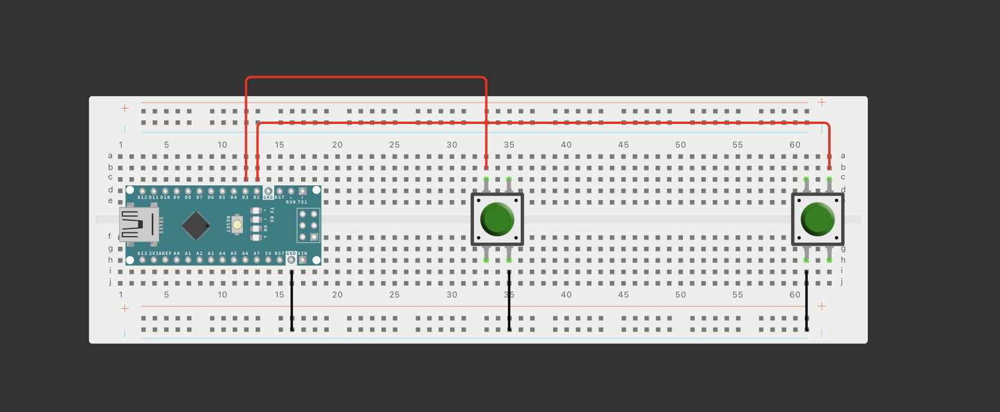
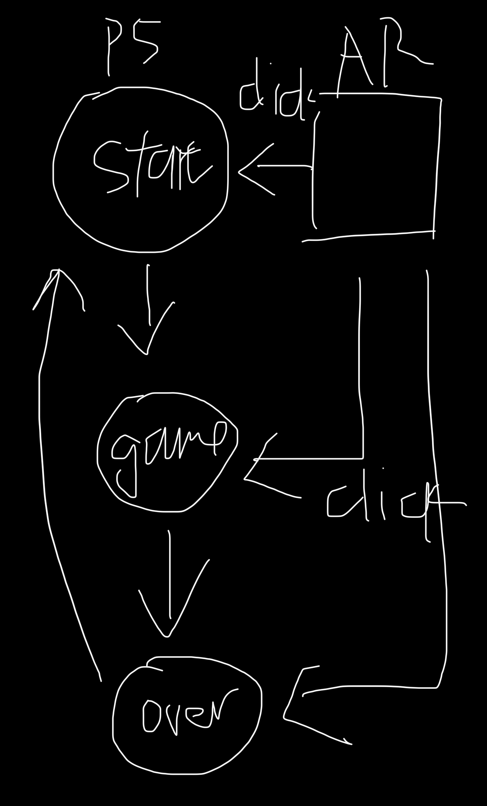
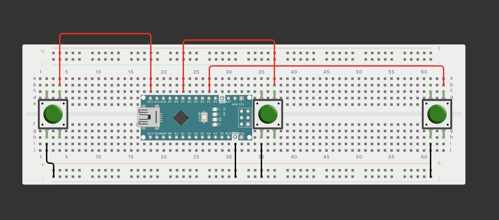
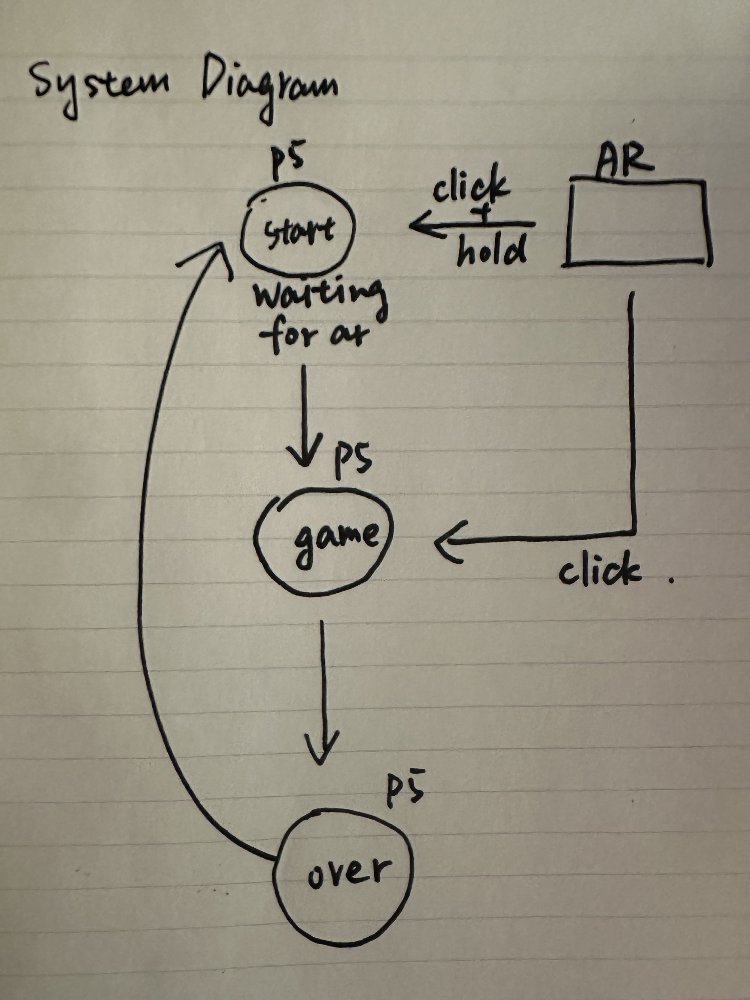

Final Project

01 | Initial Ideas

I want to create a project that explores the dynamics of interaction between individuals—how countless emotions can emerge, and how conflicts can arise. Here are my initial ideas:

	1.	Idea 1:
	    • The left side of the screen represents “I,” and the right side represents “You.”
	    • Words like “hate,” “love,” “resent,” “despise,” and “see” drop from the top of the screen.
	    • Two players use baskets at the bottom to catch the words they want.
	    • Positive words make the screen display warm colors, while negative words shift it to cold colors.
	    • The overlapping colors or graphics could visualize harmony or collapse. 

	2.	Idea 2:
	    • A circle in the middle of the screen starts falling apart.
	    • Two players must press buttons simultaneously or adjust potentiometers in sync to restore the circle.
	    • Success depends on their coordination, as they need to act in rhythm to stabilize the circle.

	3.	Idea 3:
	    • A cooperative game where players control a single character running across the screen.
	    • One button makes the character jump, and another makes it crouch.
	    • This idea feels too cliche, so I want to create something more unique and fun.

02 | Updated Proposal and Precoding

I’ve decided to abandon my initial ideas because they felt too vague as I tried to refine them. I realized I needed a more straightforward concept with clearer logic and code.

Here’s my new proposal:
I want to create a fun, competitive/cooperative game where two players count moving elements on the screen. Each player is assigned a specific type of element, and they use buttons to register the number they’ve counted. Players can either compete to see who counts more accurately or work together to ensure both counts are correct. It all depend on what the players consider a "win". I might be a little evil here but it might be fun to see what is people's standard to winning.

I wanted to use shapes like stars, moons, or suns but it might be too easy. I think I will use face/expression emojis. These will be split into two categories — positive and negative (folowing the first idea). 

The game will use two buttons on a breadboard as controllers for the players. Arduino’s role will primarily involve sending button signals to p5.js, while most of the game logic and visuals will be handled in p5.js. This setup ensures the project balances physical and digital components.

The game will have three main part. 
     
      1. Start page
      2. Gaming Page
      3. Resualt Page
The players could use the button to start the game and play the game, or restart the game. 

I initially set out to explore the intricate dynamics between individuals — how emotions fluctuate, conflicts arise, and harmony can be achieved. It’s a concept I’m still passionate about and plan to revisit in the future. I’d love to create something that uses Arduino to stimulate conversations or situations that mirror these dynamics, pushing people toward understanding and balance.

But over the past six months, I’ve gone through a period of emotional instability, where countless emotions would rush through my mind in short spans of time. It was a tough time, but my friends have been an incredible source of support. With the holiday season approaching and everyone feeling a little worn out, I want to focus on something simpler yet meaningful—a game that can bring a smile to their faces and let them enjoy a brief moment of fun together.

03 | Updates

Since I have the space on the board and an extra button, the players quantity increased to 3!!! Yay! More people more fun! Therefore I also add another category of emotion which is neutral. Like mehh.. eh... I used emojis at first but felt like the Kaomoji would look better! 

'

